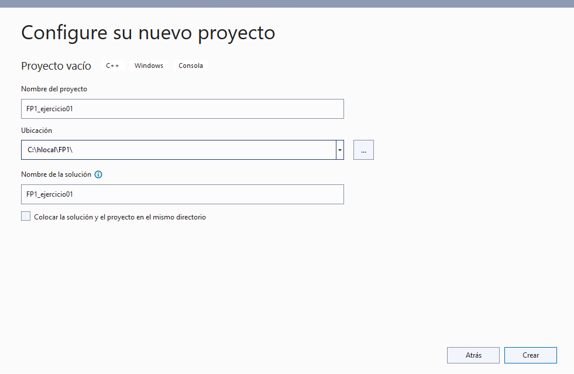

# Tutorial de uso del entorno Visual Studio 2022

## Laboratorios de Fundamentos de Programación I

En este tutorial vamos a tomar contacto con el entorno que usaremos para realizar las prácticas y ejercicios de la asignatura *Fundamentos de Programación I*

## Consejos iniciales:

- Comprueba que el equipo está encendido con el sistema operativo *SO Windows*. Los ordenadores cuentan también con el sistema *GNU/Linux*.
- Selecciona la opción de usuario local (tarda un poco en iniciarse) y proporciona tu [usuario y contraseña del laboratorio](https://informatica.ucm.es/cuenta-labs/). 
- Observa las herramientas que están instaladas en el equipo para conocerlas (ej.: *Firefox*). 
- Observa el disco `C:` con el *explorador de Windows* y localiza el directorio `C:\hlocal`. Esta es la zona de trabajo común más cómoda de utilizar. 
- Crea tu propio directorio en `C:\hlocal\FP1` para trabajar durante la sesión. **Al acabar debes borrarlo**. Ten en cuenta que al acabar la sesión otros alumnos usarán el ordenador y pueden borrar o hacer un uso malicioso de tus programas.
- Al acabar la sesión guarda una copia de tu trabajo. Lo mejor es utilizar el correo electrónico o el espacio en alguno de los [servicios de almacenamiento en la nube UCM](https://ssii.ucm.es/almacenamiento-nube-ucm). Se pueden utilizar memorias auxiliares (USB), pero no es aconsejable. **Después borra tu trabajo para que ningún alumno de otro grupo pueda utilizarlo sin tu permiso**. 
- Mantén un orden en los trabajos realizados. A lo largo del curso se hacen muchos programas y es conveniente tenerlos localizados. Por ejemplo, puedes organizar el trabajo en carpetas en un soporte de almacenamiento externo. 
- **Haz copias de seguridad de tu trabajo siempre. Esto es siempre importante, pero incluso más cuando trabajéis en los proyectos**.

## Entorno de desarrollo *Visual Studio 2022*

- Puedes abrir *Visual Studio 2022* a través del acceso directo que aparece en el Escritorio. Alternativamente puedes encontrarlo en `Todos los Programas-> Programación-> Microsoft Visual Studio 2022`.
- Selecciona la opción `Crear un proyecto`.
- En el desplegable `Todos los lenguajes` selecciona `C++` y la plantilla `Proyecto vacío`:

- Escoge un nombre de proyecto significativo y establece la ubicación en el directorio anteriormente creado.
- Cada ejercicio se resolverá en un proyecto diferente. Por ejemplo, para el ejercicio 1:

- Una vez creado tu proyecto, necesitamos agregar un archivo nuevo para trabajar con el código fuente.
- Puedes añadir un fichero pinchando con el botón derecho sobre el nombre de tu proyecto y después: `Agregar -> Nuevo elemento`.

- Selecciona la opción `Archivo C++ (.cpp)`
- A continuación dale un nombre representativo a tu fichero. En general, en las hojas de ejercicios, se dan especificaciones sobre los mismos. Por ejemplo, para el primer ejercicio: `FP1_ejercicio_01.cpp`:

- Tu entorno de trabajo está listo. A continuación, lee el enunciado del ejercicio (o ejercicios) a resolver. Los ejercicios a trabajar en cada sesión serán indicados por el profesor/a durante la sesión.
- Comienza a pensar en la manera de solucionar el ejercicio. 
- Se recomienda usar bolígrafo y papel para analizar el problema con tu compañero/a y escribir las posibles instrucciones. Cuando hayáis diseñado una posible solución, codifícadla en el editor de *Visual Studio 2022*.

## Codificando y probando nuestro programa
- Para compilar el programa puedes usar la opción `Compilar-> Compilar Solución` en el menú superior.
- Si hay algún error, se listará en la parte inferior de la pantalla. Por ejemplo, si intentas acceder a una variable que no existe, se mostrará un error similar al siguiente:

- Busca los errores, si hay alguno, y continúa hasta que el código no presente errores de compilación.
- Para poder ejecutar tu aplicación[^1], una vez no haya errores, pincha en el botón del menú superior `Depurador local de Windows` (icono de play verde).
- Se abrirá un terminal con el resultado de la ejecución de tu código fuente. Por ejemplo, para el ejercicio 1, la salida debería ser similar a:

- En los enuncidados se indicarán una serie de datos de entrada de prueba. Compruébalo con todos ellos pero, además, añade y prueba con otros casos. Una vez que el programa sea correcto y después de haberlo probado con todos los datos de entrada que proporciona el enunciado[^2] y con algunos más, lo subiremos al JuezDOM para verificarlo. 

## Probando nuestro programa con el JuezDOM

- Abre la [página del JuezDOM](http://fp.fdi.ucm.es).
- Introduce el usuario y contraseña que el profesor/a te haya entregado. Se entregará un juego de credenciales para cada pareja.
- Selecciona `Submit`
- A continuación, selecciona el archivo `.cpp` con el código del programa, selecciona el problema y el lenguaje `C++` y la opción `submit`. Por ejemplo, para el ejercicio 1:

- Espera a que el JuezDOM te de el veredicto. Si es `correct` significa que la salida es correcta:

 
- En caso contrario hay que intentar buscar el error trabajando de nuevo en nuestro proyecto desde *Visual Studio 2022*. Por ejemplo, si se trata de un error de compilación, el JuezDOM mostrará un error similar a:

- El JuezDOM utiliza una serie de ficheros con abundantes casos de prueba que le proporciona el profesor/a. El JuezDOM ejecuta tu programa y compara la salida con la dada por el profesor/a y, en caso que no coincida, produce un error.
- Ten en cuenta que el error puede estar en el formato de los datos de salida ya que la comparación se hace carácter a carácter, comparando también los saltos de línea.
- Recuerda igualmente que, aunque tu código pase las pruebas del JuezDOM, dichas pruebas no son exhaustivas. Es decir, durante la corrección manual del código pueden detectarse errores que el JuezDOM no detectó. Igualmente, durante la corrección manual, se podrán detectar, por ejemplo, mejoras en el estilo del código que el JuezDOM tampoco detecta.

## Antes de dejar el laboratorio
- Si durante la sesión quieres trabajar en otro ejercicio, puedes crear otro proyecto en *Visual Studio 2022*.
- Para terminar salva tu programa en un medio en el que puedas tener acceso fuera de la Facultad (ej.: correo o nube UCM). El archivo donde está escrito el programa se encuentra en `C:\hlocal\FP1\[nombreDelProyecto]\[nombreDelEjercicio.cpp]`. Solo es necesario salvar el fichero `.cpp` con el código fuente con el que hemos trabajado. 
- Las entregas de los códigos fuentes de los ejercicios se agruparán por lotes y se entregarán a través del Campus Virtual antes de la fecha final fijada por el profesor/a.
- Se adjuntará en el Campus Virtual otro documento detallando dichas pautas de entrega.	
- **Recuerda borrar tu trabajo** y cerrar la sesión antes de abandonar el laboratorio.

## Autores/as
- Documento original de Isabel Pita
- Modificado por David Rozas

[^1]: En futuras sesiones aprenderemos a realizar tareas de depuración (ej.: establecer puntos de interrupción).
[^2]: No aplicable al ejercicio 1 (Hola Mundo).
